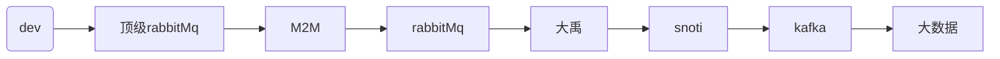

一、工作

平台安全性问题：

1. 安全性token，token必须少于七天。
2. 退出登陆，使用注销接口登出
3. 登陆：用户卸载APP，再次下载登陆。token是旧的
4. 客户使用sdk开发，需要接入接口
5. 具体实现（熟悉OpenAPI实现）

新API，修改业务BUG

cmt-dmp M2M解决依赖

阿里云物联网平台：

EMQ

多云多活

登陆接口，测试数据

疑问

