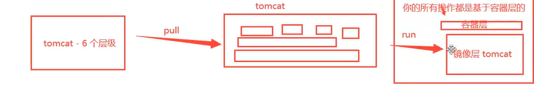

# Docker

## 底层原理

```
Docker是一个**Client-Server结构的系统，Docker守护进程（Docker daemon）运行在主机上， 然后通过Socket连接从客户端访问，守护进程从客户端接受命令并管理运行在主机上的容器。 容器，是一个运行时环境，就是我们前面说到的集装箱。
```


## 为什么Docker比较比VM快


## docker常用命令

```
帮助命令
docker version
docker info
docker 命令 --help	#帮助
帮助文档地址：https://docs.docker.com/engine/reference/commandline/images/
systemctl enable docker # 开机自动启动docker
systemctl start docker # 启动docker
systemctl restart docker # 重启dokcer
```

## 镜像命令

###  查看全部本地镜像

```
docker image
```


### **镜像搜索**

```
docker search 包名
```

### **镜像下载：**

```
docker pull 镜像名
```

### **镜像删除：**

```shell
docker rmi -f 镜像ID #删除指定的镜像
docker rmi -f 镜像ID 镜像ID镜像ID#删除多个镜像
docker rmi -f $(docker images -aq) #删除全部镜像
```

### 查看镜像历史变更历史

```shell
docker history IMAGE ID
```


## **容器命令**

### **新建容器并启动**:

``` 
docker run [可选参数] image
#参数说明
--name='NAME' #容器名
-d #后台方式运行
-it #交互运行方式
-p #指定容器端口 -p 8080:8080
```

### 列出所有运行的容器

```
docker ps 命令	#列出当前在运行的容器
-a #列出当前在运行的容器，带出历史运行的容器
-n=? #显示最近创建的容器，显示个数
-a #显示容器的编号，-aq显示容器编号
```

### 退出容器

```
exit #停止容器并推出
ctrl +P+Q #容器不停止退出
```

### 删除容器

```
docker rm 容器ID 	#删除指定容器，不能删除正在运行容器
docker rm -f $(docker ps -aq) #删除所有容器
docker ps -a -q|xargs docker rm #删除所有容器
```

### 启动和停止容器操作

```
docker start 容器ID	#启动容器
docker restart 容器id #重启容器
docker stop #停止容器
```

## **常用其他命令**

### 后台启动容器

```
docker run -d 镜像名
#问题docker ps ,发现centos停止
#docker 容器使用后台运行，必须要有一个前台进程，docker发现没有应用，就自动停止
#nginx，容器启动后，发现自己没有提供服务，就会立刻停止
```

### 日志查询

```
docker -f -t --tail 数据条数 容器ID
#自己写一段日志Shell
docker run -d centos /bin/sh -c "while true;do echo kaung1;sleep 1;done"
#显示日志
-tf	#显示日志
--tail	#要显示的日志条数

```

### 查看容器中的进程信息

```
#top命令
docker top 容器ID
UID                 PID                 PPID                C                   STIME               TTY                 TIME                CMD
root                41620               41601               0                   12:27               ?                   00:00:00            /bin/sh -c while true;do echo kaung1;sleep 1;done
root                42191               41620               0                   12:36               ?                   00:00:00            /usr/bin/coreutils --coreutils-prog-shebang=sleep /usr/bin/sleep 1
```

### 查看镜像元数据

```
docker inspect 镜像id	#
```

### 进入当前正在运行的容器

```
#通常容器使用后台方式运行，需要进入容器，修改配置
#方式一
docker exec -it 容器id /bin/bash	#进入容器后开启一个新的终端，可以在里面操作(常用)
#方式二：
docker attach -it 容器名 /bin/bash	#进入容器正在执行的终端，不会启动新的进程
```

### 从容器内拷贝到本机

```
#在容器内部新建一个文件，然后退出容器，使用本机终端拷贝容器文件。
docker cp 容器名:/容器内文件路劲 /本机路径
```

### 从本机拷贝到容器

```
docker cp  /本机文件路径 容器名:/容器路径
```

### 查看docker镜像端口映射情况

```
docker container port CONTAINER
	8080/tcp -> 0.0.0.0:9090
	8080/tcp -> :::9090	
```


### 小结


## 软件安装

### docker安装nginx

```
1、搜索镜像	#search 建议dockerhub搜索，观看详细信息
2、下载镜像 	#pull
3、运行测试：docker run -d --name nginx01 -p 3344:80 nginx
	-d 后台运行
	-name 容器名
	-p 端口映射，将容器暴露出来的3344端口，映射到80端口
```

端口暴露


### docker部署tomcat

```
#官方使用（用完就删除容器）
docker run -it --rm tomcat:9.0
#我们之前的启动都是后台，容器可以查到。（官方方式测试适用）

#正常下载启动
pull下载 启动
	docker run -d --name tomcat01 -p 3355:8080 tomcats
#运行之后不能成运行（阿里云镜像问题，默认最小镜像），需要把webapps.dist文件拷贝到webapps文件夹下面，就可以访问tomcat欢迎界面
```

### docker部署ES+kibana

```
es	
#暴露端口很多、十分消耗内存、数据一般需要防止到安全目录！挂载、
#--net somenetwork ?网路配置
#启动elasticsearch
docker run -d --name elasticsearch -p 9200:9200 -p 9300:9300 -e "discovery.type=single-node" elasticsearch:7.6.2

#启动linux会卡住，docker status 查看cpu状态
#需要增加内存限制,修改配置文件-e，环境配置修改
docker run -d --name elasticsearch -p 9200:9200 -p 9300:9300 -e "discovery.type=single-node" -e ES_JAVA_OPTS="-Xms64m -Xms512m" elasticsearch:7.6.2s
```


## 可视化

### portainer：Docker图形化管理界面

## Docker镜像讲解

### 镜像是什么

```
镜像是一种轻量级、可执行的独立软件包,用来打包软件运行环境和基于运行环境开发的软件,它包含运行某个软件所需的所有内容,包括代码、运行时、库、环境变量和配置文件。
```

### 如何得到镜像

```
1. 从远程仓库下载
2. 本地拷贝
3. 自己制作镜像DockerFile
```

### 联合文件系统

```
	UnionFS (联合文件系统) : Union文件系统( UnionFS)是一种分层、 轻量级并且高性能的文件系统,它支持对文件系统的修改作为一次提交来-层层的叠加,同时可以将不同目录挂载到同一个虚拟文件系统下(unite several directories into a single virtual filesystem)。Union 文件系统是Docker镜像的基础。镜像可以通过分层来进行继承,基于基础镜像(没有父镜像) , 可以制作各种具体的应用镜像。
	特性:一次同时加载多个文件系统,但从外面看起来,只能看到-个文件系统,联合加载会把各层文件系统叠加起来,这样最终的文件系统会包含所有底层的文件和目录
	比如:nginx镜像包含了centos镜像，则该容器内部另外镜像，mysql不需要另外下载centos镜像。可直接共用！
```

### Docker镜像加载原理

```
	docker的镜像实际上由一层层的文件系统组成,这种层级的文件系统UnionFS。
	bootfs(boot file system)主要包含bootloader和kernel, bootloader主要是引导加载kernel, Linux刚启动时会加载bootfs文件系统,在Docker镜像的最底层是bootfs。这一层与我们典型的Linux/Unix系统是一样的,包含boo加载器和内核。当boo加载完成之后整个内核就都在内存中了,此时内存的使用权已由bootfs转交给内核,此时系统也会卸载bootfs.
	rootfs (root file system) , 在bootfs之上。包含的就是典型Linux系统中的/dev, /proc, /bin, /etc等标准目录和文件。rootfs就是各种不同的操作系统发行版,比如Ubuntu , Centos等等。
	精简OS操作系统只包含指令操作命令，bootfs文件就精简了不少。（虚拟机分钟级，容器秒级）
```

							镜像加载图

## 镜像分层理解

```
	所有的Docker镜像都起始于一个基础镜像层,当进行修改或增加新的内容时,就会在当前镜像层之上,创建新的镜像层。
举一个简单的例子,假如基于Ubuntu Linux 16.04创建一个新的镜像 ,这就是新镜像的第-层;如果在该镜像中添加Python包,
就会在基础镜像层之上创建第二个镜像层;如果继续添加一个安全补丁, 就会创建第三个镜像层。
	镜像之间若有组件交互，可以互相访问获取。具体见联合镜像系统
```

```
特点：
	Docker镜像都是只读的,当容器启动时,一个新的可写层被加载到镜像的顶部!
这一层就是我们通常说的容器层,容器之下的都叫镜像层!
```

		镜像下载，容器打包过程

commit镜像（提交容器）

```
docker commit 提交容器成为一个副本
docker commit -m=
```

docker 内部系统配置能共享到外层操作系统吗？

手动开放docker端口映射：比如外层8080：容器9090？

## DockerFile

### DockerFile构建过程

```shell
#基础知识:
1、每个保留关键字(指令)都是必须是大写字母
2.执行从上到下顺序执行
3. #表示注释
4、每一个指令都会创建提交-个新的镜像层 ,并提交!

dockerfile是用来构建dokcer镜像的文件!令参数脚本!
#构建步骤:
1、编写一个dockerfile 脚本文件
2、docker build构建成为一个镜像
3、docker run运行镜像
4、docker push发布镜像( DockerHub、阿里云镜像仓库!)
#注意：官方镜像是精简版本，镜像需要自己数据构建
```


dockerFile面向开发

Docker镜像渐成为企业交付的标准,必须要掌握! I

```shell
#步骤:开发,部署,运维。。。缺一不可
DockerFile:构建文件,义了一切的步骤,源代码
Dockerlmages :通过DockerFile构建生成的镜像.最终发布和运行的产品!
Docker容器:容器就是镜像运行起来提供服务器
```

### DockerFile指令

```shell
FROM			#基础镜像,一切从此构建
MAINTAINER		 #镜像的作者，姓名+邮箱
RUN 			#镜像构建的运行的命令
ADD				#步骤，添加内容
WORKDIR			#镜像工作目录
VOLUME			#挂在目录
EXPOST 			#保留的端口
CMD				#直嘀咕容器启动的时候需要运行的命令，只有最后一个命令会生效，可被替代
ENTRYPOINT		#指定容器启动运行的命令，可以追加
ONBUILD			#构建一个被继承的DockerFile这个时候就会运行ONBUILD指令，触发指令
COPY			#类似ADD,将我们文件拷贝到镜像中
ENV				#构建的时候设置的环境变量
```

### docker 换源

```
{ 
  "registry-mirrors": [
      "https://hub-mirror.c.163.com",
      "https://ghcr.io",
      "https://mirror.baidubce.com" 
                                    ]
}

```


### 实战测试 1、自定义创建centos镜像

Docker Hub中绝大多数镜像都是从基础镜像过来

#

```shell
# 1 编写DockerFile文件 
FROM centos
MAINTAINER yc<yc_13456@163.com>

ENV MYPATH /usr/local	#进入系统的目录，一般设置成工作目录
WORKDIR $MYPATH

RUN /bin/sh -c yum -y insta1l vim	#（一般情况下：RUN yum -y insta1l vim）
RUN /bin/sh -c yum -y insta1l vim net-tools
EXPOSE 80

CMD echo $MYPATH
CMD echo "----end----"
CMD /bin/bash

# 2 通过文件构造镜像
docker build -f mydockerfile-centos -t mycentos:0.1 .
#结果
Successfully built 06999096179c
Successfully tagged mycentos:0.1
```


### 实战测试2、创建Tomcat镜像（未完待续...）

```shell
FROM centos
MAINTAINET yc<yc_13456@163.com>

COPY readme.txt /usr/yc/readme.txt

ADD jdk-8u221-linux-x64.tar.gz /home/yc
ADD apache-tomcat-9.0.50.tar.gz /home/yc

RUN yum -y install vim
RUN MYPATH /home/yc
WORKDIR $MYPATH

ENV JAVA_HOME /home/yc/jdk1.8.1_22
ENV CLASSPATH $JAVA_HOME/lib/dt/jar:$JAVA_HOME/lib/tools.jar
ENV CATALINA_HOME /home/yc/apache-tomcat-9.0.50
ENV CATALINA_BASH /home/yc/apache-tomcat-9.0.50
ENV PATH $PATH:$JAVA_HOME/bin:$CATALINA_HOME/lib:$CATALINA_HOME/bi

EXPOSE 8080

CMD /home/yc/apache-tomcat-9.0.50/bin/startup.sh &&tail -F /home/yc/apache-tomcat-9.0.50/bin/logs/catalina.out
```

### 容器内部查看端口

```shell
ps -ef | grep 50000
```

## DockerHub

### 登陆dockerHub

```shell
docker login
docker login -u userID -p passwd 远程仓库名
```

### 登出dockerHub

```shell
docker lougout url
```

查看登陆信息

```shell
cat ~/.docker/config.json 
```

推送镜像到远程仓库

```shell
#打标签
docker tag 镜像ID dockerHub用户名称/远程仓库名:tag
#推送
docker push dockerHub用户名称/远程仓库名:tag
```


打包镜像成tar

```
 docker save -o my_ubuntu_v3.tar runoob/ubuntu:v3
```


## docker-compose

### 安装

```
curl -L https://get.daocloud.io/docker/compose/releases/download/1.24.1/docker-compose-`uname -s`-`uname -m` > /usr/local/bin/docker-compose

chmod +x /usr/local/bin/docker-compose

docker-compose --version
```

