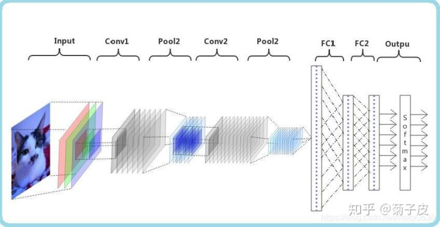
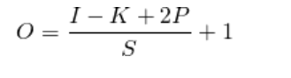
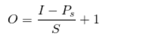

# **Pytorch**

## 张量

### 生成张量

#### 直接生成

```python
data = [[1, 2], [3, 4]]
x_data = torch.tensor(data)
```

#### Numpy数组生成

```python
data = [[1, 2], [3, 4]]
np_array = np.array(data)
x_np = torch.from_numpy(np_array)
```

#### 指定数据维度长度生成

```python
rand_tensor = torch.rand(shape)
ones_tensor = torch.ones(shape)
zeros_tensor = torch.zeros(shape)

print(f"Random Tensor: \n {rand_tensor} \n")
print(f"Ones Tensor: \n {ones_tensor} \n")
print(f"Zeros Tensor: \n {zeros_tensor}")
```

#### 复制生成

```python
x_ones = torch.ones_like(x_data)   # 保留 x_data 的属性
print(f"Ones Tensor: \n {x_ones} \n")

x_rand = torch.rand_like(x_data, dtype=torch.float)   # 重写 x_data 的数据类型
                                                      # int -> float
print(f"Random Tensor: \n {x_rand} \n")
```

### 张量属性

```python
# 从张量属性我们可以得到张量的维数、数据类型以及它们所存储的设备(CPU或GPU)
tensor = torch.rand(3,4)

print(f"Shape of tensor: {tensor.shape}")
print(f"Datatype of tensor: {tensor.dtype}")
print(f"Device tensor is stored on: {tensor.device}")
```

### 张量运算

#### 索引和切片

```python
tensor = torch.ones(4, 4)
tensor[:,1] = 0            # 将第1列(从0开始)的数据全部赋值为0
print(tensor)
```

#### 拼接

```python
tensor = torch.ones(4, 4)
tensor[:,1] = 0            # 将第1列(从0开始)的数据全部赋值为0
print(tensor)

t1 = torch.cat([tensor, tensor, tensor], dim=0)	# dim = 0 行拼接；1 列拼接
print(t1)
```

#### 乘积和矩阵乘法

```python
# 逐个元素相乘
tensor = torch.ones(4, 4)
tensor[:,1] = 2            # 将第1列(从0开始)的数据全部赋值为0
print(tensor)

print(f"tensor.mul(tensor): \n {tensor.mul(tensor)} \n")
# 等价写法:
print(f"tensor * tensor: \n {tensor * tensor}")
```

```python
# 矩阵乘法
tensor = torch.ones(4, 4)
tensor[:,1] = 2            # 将第1列(从0开始)的数据全部赋值为0
print(tensor)

print(f"tensor.matmul(tensor.T): \n {tensor.matmul(tensor)} \n")
# 等价写法:
print(f"tensor @ tensor.T: \n {tensor @ tensor.T}")
```

#### 自动赋值运算

```python
# 自动赋值运算通常在方法后有 _ 作为后缀, 例如: x.copy_(y), x.t_()操作会改变 x 的取值
tensor = torch.ones(4, 4)
tensor[:,1] = 2            # 将第1列(从0开始)的数据全部赋值为0
print(tensor, "\n")
tensor.add_(5)
print(tensor)

#注意：自动赋值运算虽然可以节省内存, 但在求导时会因为丢失了中间过程而导致一些问题
```

### Tensor与Numpy的转化

#### 张量->Numpy array

```python
# 张量和Numpy array数组在CPU上可以共用一块内存区域, 改变其中一个另一个也会随之改变
t = torch.ones(5)
print(f"t: {t}")
n = t.numpy()
print(f"n: {n}")

t.add_(1)
print(f"t: {t}")
print(f"n: {n}")
```

#### Numpy array->张量

```python
n = np.ones(5)
t = torch.from_numpy(n)

np.add(n, 1, out=n)
print(f"t: {t}")
print(f"n: {n}")
```

### PIL与numpy转化

```python
# PIL转numpy
from PIL import Image
import numpy as np
from matplotlib import pyplot as plt
# 图片的相对路径
path="./image.jpg"
pil_img = Image.open(path)
# PIL转numpy
num_img = np.asarray(pil_img)
plt.imshow(num_img)
plt.show()
```

```python
# numpy转PIL
from PIL import Image
import numpy as np
from matplotlib import pyplot as plt
# 图片的相对路径
path="./image.jpg"
num_img = plt.imread(path)
# numpy转PIL
pil_img = Image.fromarray(np.uint8(num_img))
pil_img.show()
```


## torch.autograd

​	torch.autograd是 PyTorch 的自动差分引擎，可为神经网络训练提供支持。 在本节中，您将获得有关 Autograd 如何帮助神经网络训练的概念性理解。

### 背景

​	神经网络（NN）是在某些输入数据上执行的嵌套函数的集合。 这些函数由*参数*（由权重和偏差组成）定义，这些参数在 PyTorch 中存储在张量中。

​	训练 NN 分为两个步骤：

​		**正向传播**：在正向传播中，NN 对正确的输出进行最佳猜测。 它通过其每个函数运行输入数据以进行猜测

​		**反向传播**：在反向传播中，NN 根据其猜测中的误差调整其参数。 它通过从输出向后遍历，收集有关函数参数（*梯度*）的误差导数并使用梯度下降来优化参数来实现。 有关反向传播的更详细的演练，请查看 3Blue1Brown 的[视频](https://www.youtube.com/watch?v=tIeHLnjs5U8)。

### 在 PyTorch 中的用法

```
x = torch.randn(3, requires_grad=True)
print(x)
y = x * 2
z = y * y * 3
out = z.mean()
print(z, out)
out.backward()
print(x.grad)
```

## dataset

提供一种方式去回去数据及其label：如何获取每个数据及其label；总共数据量

## dataLoader

为后面的网络提供不同的数据形式

## 卷积神经网络（CNN）

### 组件

- 数据输入层/ Input layer
- 卷积计算层/ CONV layer
- 池化层 / Pooling layer
- 全连接层 / FullConnect layer
- 输出层 / Output layer

当然也还包括神经网络常用的激活层，正则化层等

详细内容：[卷积神经网络入门与基于Pytorch图像分类案例 - 知乎 (zhihu.com)](https://zhuanlan.zhihu.com/p/339777736)



卷积核：

**卷积核在图像识别中也称过滤器**。比较简单的过滤器有：Horizontalfilter、Verticalfilter、Sobel Filter等。这些过滤器能够检测图像的水平边缘、垂直边缘、增强图像区域权重等，这里不做细致探究。其实，过滤器的作用类似于标准(例如全连接层)的权重矩阵W，需要通过梯度下降算法反复迭代求得。而**卷积神经网络的主要目的就是计算出这些卷积核。**

### CNN张量尺寸和参数计算

1. [卷积神经网络(CNN)张量(图像)的尺寸和参数计算(深度学习) - 冂冋冏囧 - 博客园 (cnblogs.com)](https://www.cnblogs.com/touch-skyer/p/9150039.html)
2. [(19条消息) CNN卷积神经网络原理讲解+图片识别应用（附源码）_学海无涯-CSDN博客_cnn图像识别](https://blog.csdn.net/kun1280437633/article/details/80817129)

注：卷积层中,核的深度等于输入图像的通道数

卷积神经网络计算

#### 卷积层输出张量计算：

定义如下：

```
O=输出图像的尺寸。
I=输入图像的尺寸。
K=卷积层的核尺寸
N=核数量
S=移动步长。
P =填充数
```

输出图像尺寸计算公式：



注：输出图像的通道数等于核数量N

#### 池化层输出张量大小：

定义如下：

```
O=输出图像的尺寸。
I=输入图像的尺寸。
S=移动步长
PS=池化层尺寸
```

输出图像尺寸的计算公式如下：



注：池化层的输出通道数不改变。


### 损失函数

1. 计算实际输出与目标之间的差距
2. 为我们更新输出提供一定的依据

安装：

pytorch1.8.1+torchvision 0.9.1
